# HANGaDICTATOR by coffeebeanstudio1809@gmail.com
The live link can be found [here](https://hang-a-dictator.herokuapp.com/)

# HANGaDICTATOR
HANGaDICTATOR is a game build using a python.

## Features
HANGaDICTATOR python game is an equivalent to hangman game except the player needs to guess a word by guessing a letter in it to hang a man (dictator), if the word is not guessed the player has lost and the dictator escape.

### Existing Features

- **Feature #1**

    - The game starts with entering the player name. One letter or a number won't be accepted as a name. The name will start with a capital letter even if player enter a lowercase letter.

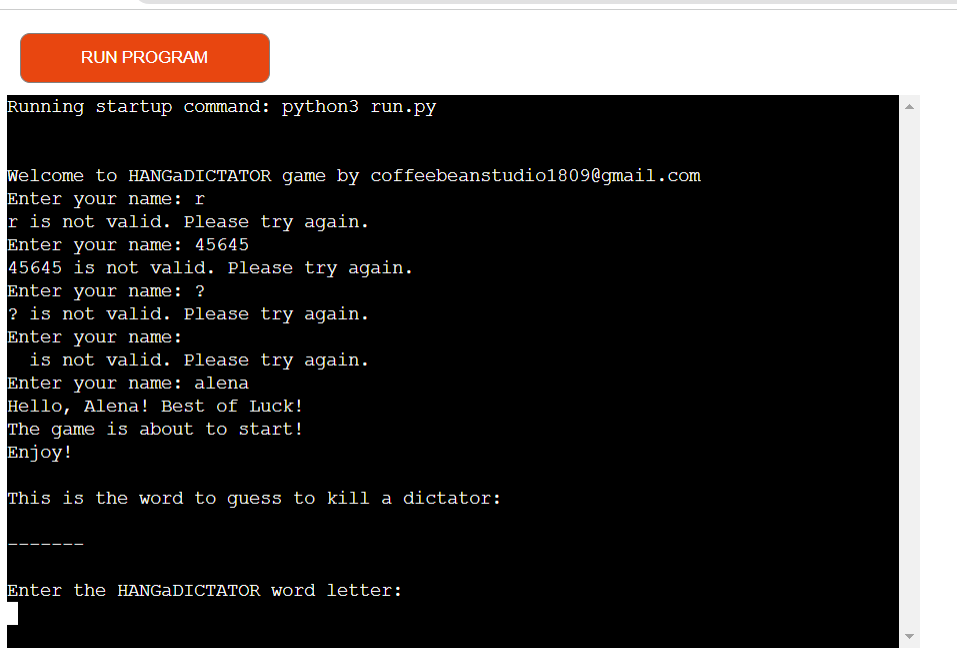

- **Feature #2**

    - After entering the name, the game will start. The words that were used in the game are nouns that opposite to the dictator regime. Every new game will give a different word to guess. The player should guess a word by entering a letter. The player has six attempts to enter a wrong letter. The game has been lost and over if all six attempts are fail. 

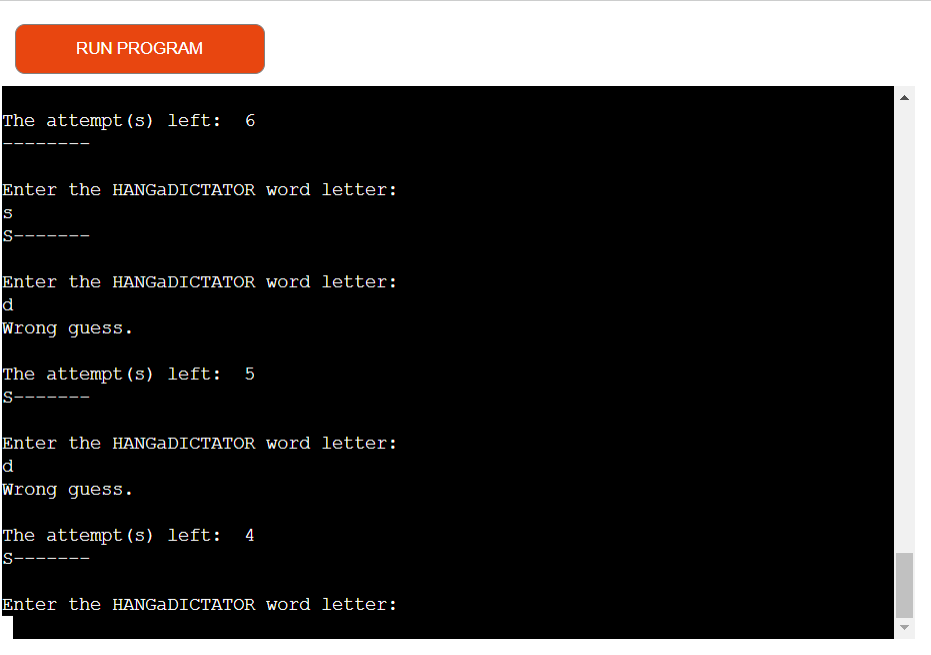
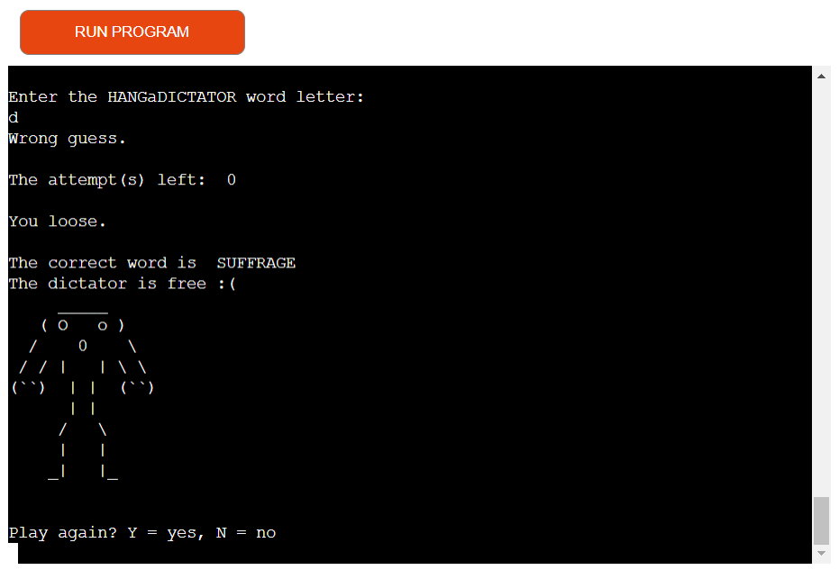

- **Feature #3**

    - The player can't enter number or more than one letter at once.

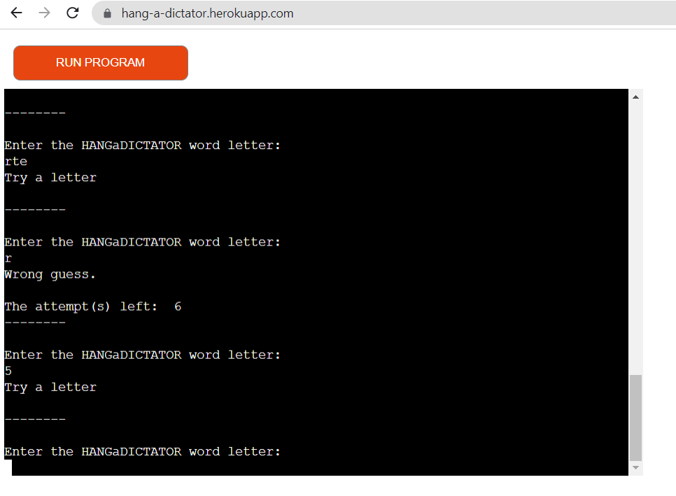

- **Feature #4**

    - If the player guessed the word the game is over and the dictator is hung.

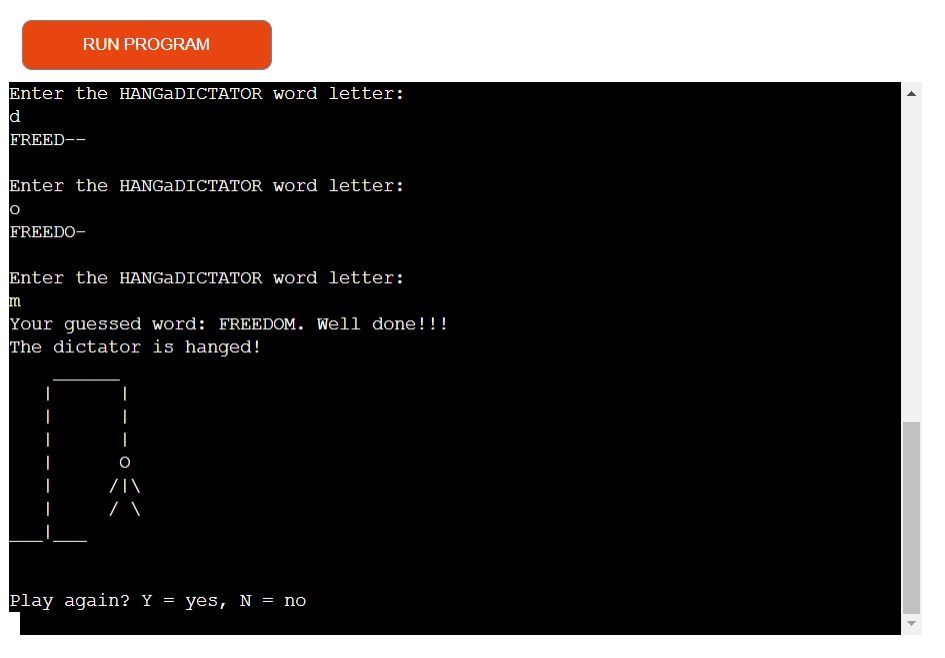

- **Feature #5**

    - When the game is over, the sentence appears inviting the player to play again or to leave the game. The player can enter only Y for Yes or N for no. "Y" or "y" - the game will execute again and to exit the game the player types "N" or "n". 

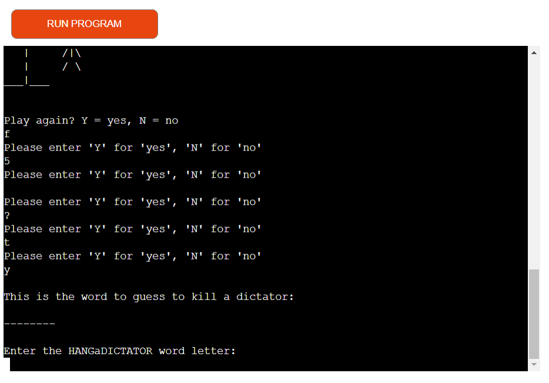
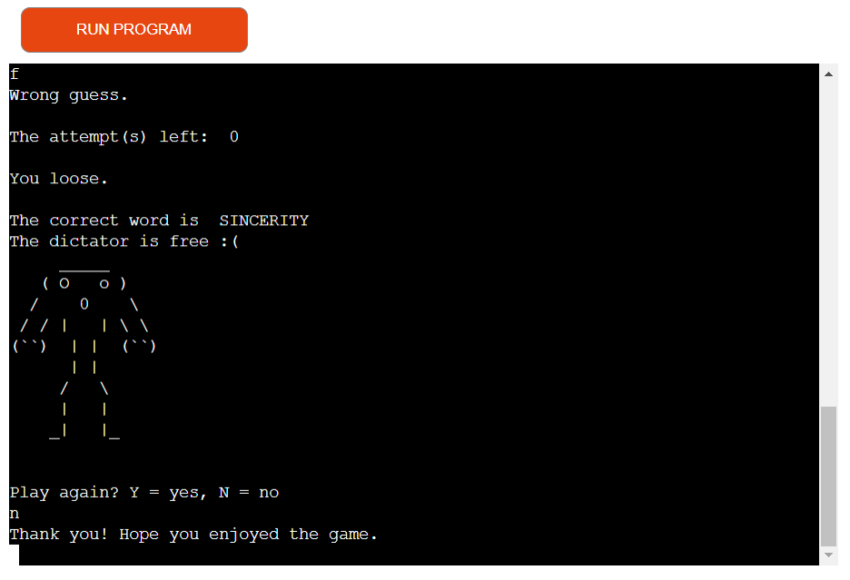

- **Feature #6**

    - For replayability the word is always randomized from a list of 20 words. 

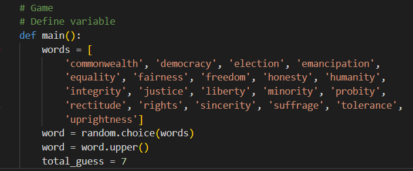

- **Feature #7**

    - Used a clear screen function. 

### Future Features

Implement a timer to stop a game to make it more difficult.

## Tools & Technologies Used

- [Python](https://www.python.org) used as the back-end programming language.
- [Git](https://git-scm.com) used for version control. (`git add`, `git commit`, `git push`)
- [GitHub](https://github.com) used for secure online code storage.
- [GitHub Pages](https://pages.github.com) used for hosting the deployed front-end site.
- [Gitpod](https://gitpod.io) used as a cloud-based IDE for development.
- [Markdown Builder by Tim Nelson](https://traveltimn.github.io/readme-builder) used to help generate the Markdown files.
- [Heroku](https://www.heroku.com) used for hosting the deployed back-end site.

## Data Model

### Classes & Functions

Parameters:
name
textName
play
words
total_guess
guess
guessed

The primary functions used on this application are:

- `nameText()`
    - Get names input from the user.
- `getName()`
    - Get names input from the user if user enter a wrong name.
- `onceagain()`
    - Play game once again if the game is over.
- `main()`
    - Run game function.

### Imports

I've used the following Python packages and/or external imported packages.

- `time`: used for adding time delays
- `random`: used to get a random choice from a list
- `os`: used to clear an operating system screen

## Deployment

Code Institute has provided a [template](https://github.com/Code-Institute-Org/python-essentials-template) to display the terminal view of this backend application in a modern web browser.
This is to improve the accessibility of the project to others.

The live deployed application can be found deployed on [Heroku](https://hang-a-dictator.herokuapp.com).

### Heroku Deployment

This project uses [Heroku](https://www.heroku.com), a platform as a service (PaaS) that enables developers to build, run, and operate applications entirely in the cloud.

Deployment steps are as follows, after account setup:

- Select **New** in the top-right corner of your Heroku Dashboard, and select **Create new app** from the dropdown menu.
- Your app name must be unique, and then choose a region closest to you (EU or USA), and finally, select **Create App**.
- From the new app **Settings**, click **Reveal Config Vars**, and set the value of KEY to `PORT`, and the value to `8000` then select *add*.
- If using any confidential credentials, such as CREDS.JSON, then these should be pasted in the Config Variables as well.
- Further down, to support dependencies, select **Add Buildpack**.
- The order of the buildpacks is important, select `Python` first, then `Node.js` second. (if they are not in this order, you can drag them to rearrange them)

Heroku needs two additional files in order to deploy properly.
- requirements.txt
- Procfile

You can install this project's **requirements** (where applicable) using:
- `pip3 install -r requirements.txt`

If you have your own packages that have been installed, then the requirements file needs updated using:
- `pip3 freeze --local > requirements.txt`

The **Procfile** can be created with the following command:
- `echo web: node index.js > Procfile`

For Heroku deployment, follow these steps to connect your own GitHub repository to the newly created app:

Either:
- Select **Automatic Deployment** from the Heroku app.

Or:
- In the Terminal/CLI, connect to Heroku using this command: `heroku login -i`
- Set the remote for Heroku: `heroku git:remote -a app_name` (replace *app_name* with your app name)
- After performing the standard Git `add`, `commit`, and `push` to GitHub, you can now type:
	- `git push heroku main`

The frontend terminal should now be connected and deployed to Heroku!

### Local Deployment

This project can be cloned or forked in order to make a local copy on your own system.

For either method, you will need to install any applicable packages found within the *requirements.txt* file.
- `pip3 install -r requirements.txt`.

If using any confidential credentials, such as `CREDS.json` or `env.py` data, these will need to be manually added to your own newly created project as well.

#### Cloning

You can clone the repository by following these steps:

1. Go to the [GitHub repository](https://github.com/Alena18/HANGaDICTATOR) 
2. Locate the Code button above the list of files and click it 
3. Select if you prefer to clone using HTTPS, SSH, or GitHub CLI and click the copy button to copy the URL to your clipboard
4. Open Git Bash or Terminal
5. Change the current working directory to the one where you want the cloned directory
6. In your IDE Terminal, type the following command to clone my repository:
	- `git clone https://github.com/Alena18/HANGaDICTATOR.git`
7. Press Enter to create your local clone.

Alternatively, if using Gitpod, you can click below to create your own workspace using this repository.

Please note that in order to directly open the project in Gitpod, you need to have the browser extension installed.
A tutorial on how to do that can be found [here](https://www.gitpod.io/docs/configure/user-settings/browser-extension).

#### Forking

By forking the GitHub Repository, we make a copy of the original repository on our GitHub account to view and/or make changes without affecting the original owner's repository.
You can fork this repository by using the following steps:

1. Log in to GitHub and locate the [GitHub Repository](https://github.com/Alena18/HANGaDICTATOR)
2. At the top of the Repository (not top of page) just above the "Settings" Button on the menu, locate the "Fork" Button.
3. Once clicked, you should now have a copy of the original repository in your own GitHub account!

### Local VS Deployment

There is no potential difference between local and heroku deployment

## Credits

I used help of my tutor [Tim Nelson](https://github.com/TravelTim) from CodeInstitute, thanks very much to him for all support! CodeInstitute lessons and also
[YouTube](https://www.youtube.com/watch?v=pFvSb7cb_Us)

### Acknowledgements

- I would like to thank my Code Institute tutor, [Tim Nelson](https://github.com/TravelTim) for their support throughout the development of this project.
- I would like to thank the [Code Institute](https://codeinstitute.net) tutor team for their assistance with troubleshooting and debugging some project issues.
- I would like to thank the [Code Institute Slack community](https://code-institute-room.slack.com) for the moral support; it kept me going during periods of self doubt and imposter syndrome.

## Testing

Test was done in heroku app and gitpod during writing a code. The game working without any issue.

## Code Validation

### Python

I have used the recommended [CI Python Linter](https://pep8ci.herokuapp.com) to validate all of my Python files.

| File | CI URL | Screenshot | Notes |
| --- | --- | --- | --- |
| run.py | [CI PEP8](https://pep8ci.herokuapp.com/https://raw.githubusercontent.com/Alena18/hangadictator/main/run.py) | 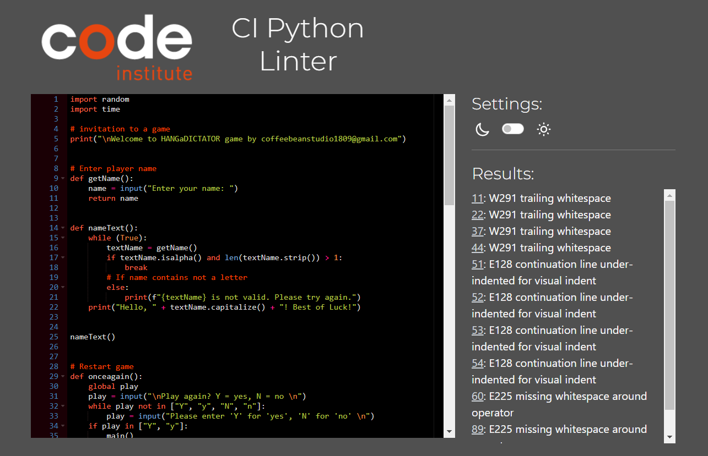 | W291 trailing whitespace |
| run.py | [CI PEP8](https://pep8ci.herokuapp.com/https://raw.githubusercontent.com/Alena18/hangadictator/main/run.py) |  | E305 expected 2 blank lines after class or function definition, found 0 |
| run.py | [CI PEP8](https://pep8ci.herokuapp.com/https://raw.githubusercontent.com/Alena18/hangadictator/main/run.py) | 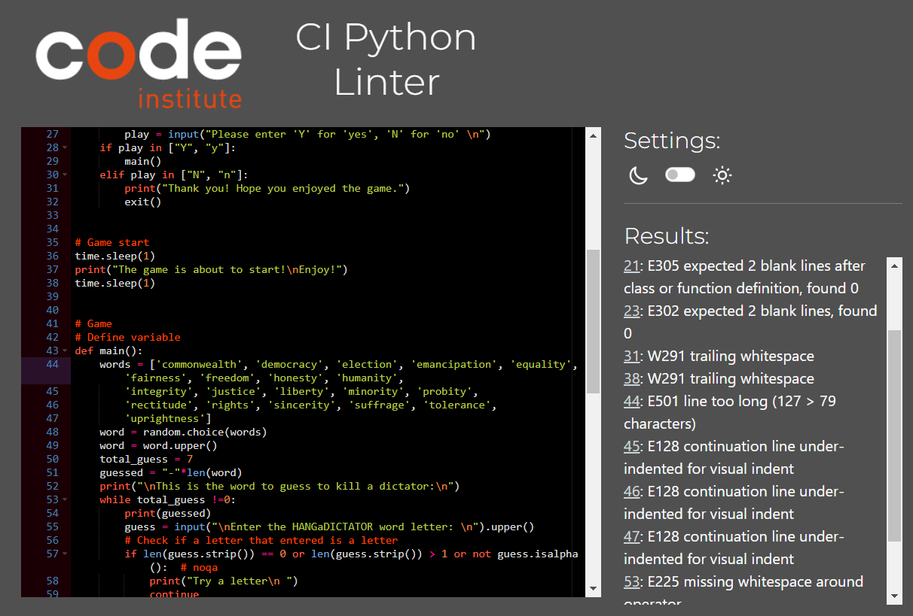 | E501 line too long |
| run.py | [CI PEP8](https://pep8ci.herokuapp.com/https://raw.githubusercontent.com/Alena18/hangadictator/main/run.py) | 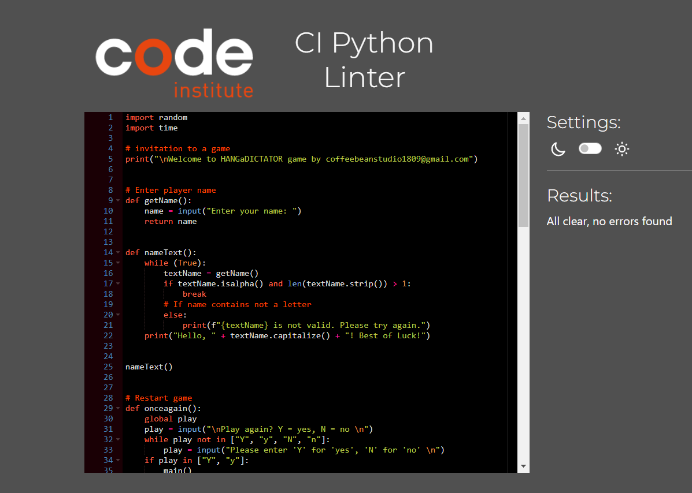 | Pass: No Errors |

## Defensive Programming

- Users must enter a valid letter when prompted

    - 

- Users must choose from a "yes" or "no" from replay.

    - 

- User should enter a valid name with alpha character and at least more then one character.

    - 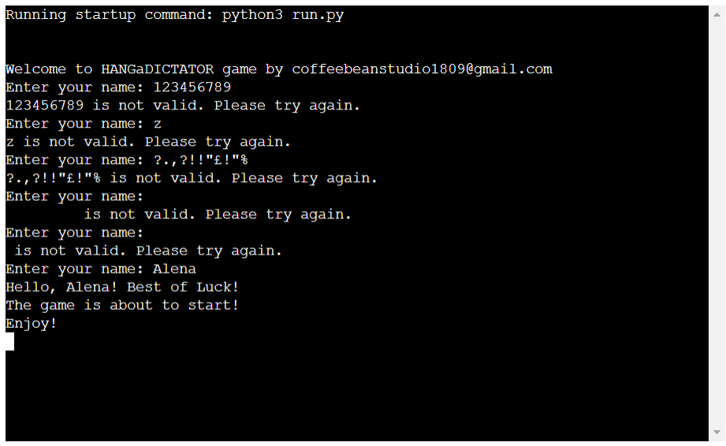

## Unfixed Bugs

No unfixed bugs left.

Thank you for your time.